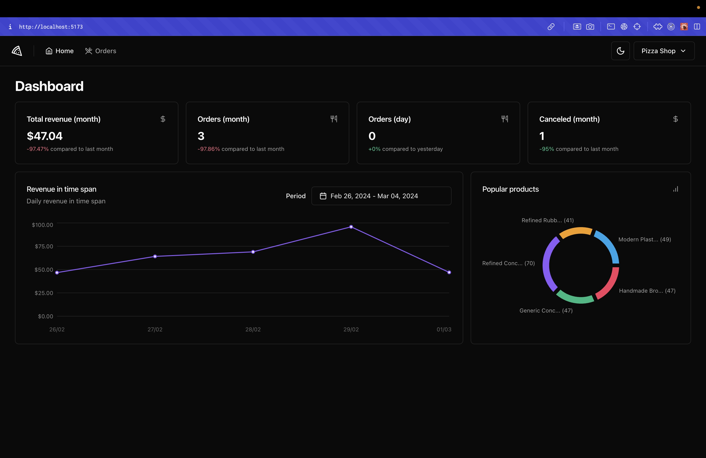
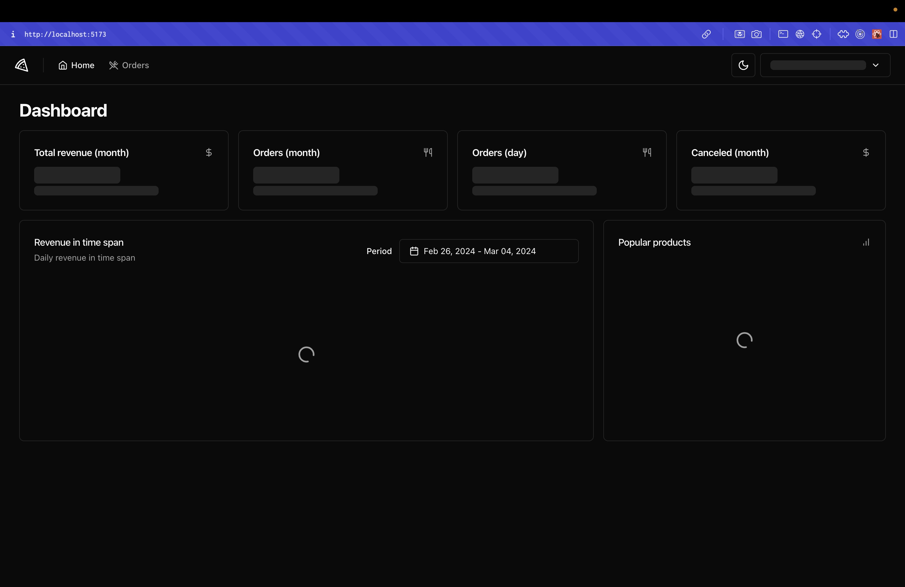
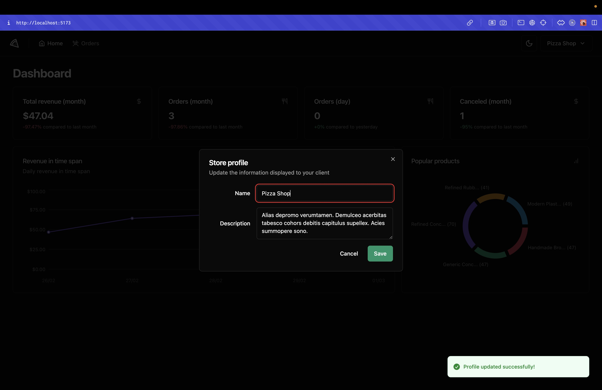
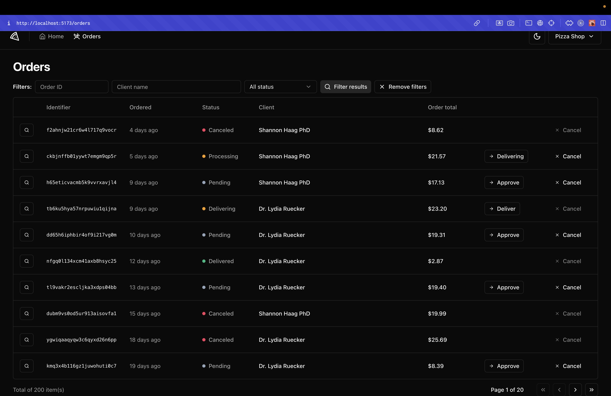
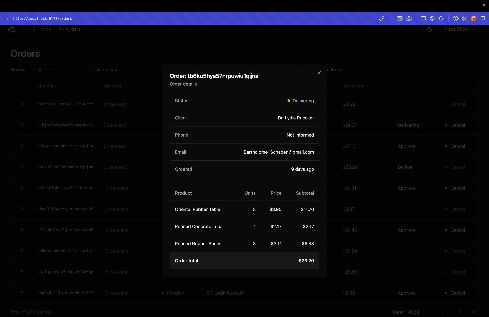

# Pizza Shop - Web

## The App
A IaaS inspired platform of product's data revenue view and status control. 
Focused on implementing api integration through HTTP State. 
The backend API was developed by the Rocketseat Education.

### Previews

  
  
  
  
  
  

### Techs
1. React
2. Typescript
3. Tailwind CSS
4. Axios
5. React Router DOM
6. React Hook Form
7. Zod
8. Testing Library
9. Playwright

### Steps
1. Clone this repository;
2. Run your preferred command to install dependencies:
- `npm install`
- `yarn install` 
- `pnpm install` 
3. Fill `VITE_API_URL` and `VITE_ENABLE_API_DELAY` to test response delay env vars in a `.env` file as the example inside `.env.example`;
4. Clone the [API backend repository](https://github.com/rocketseat-education/pizzashop-api) from Rocketseat Education and follow its steps;
5. Run the app with: 
- `npm run dev`
- `yarn dev` 
- `pnpm run dev` 